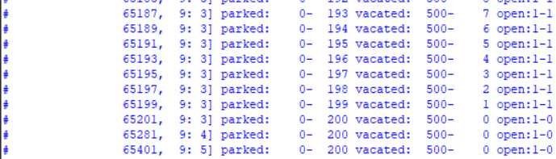
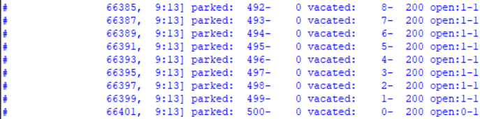
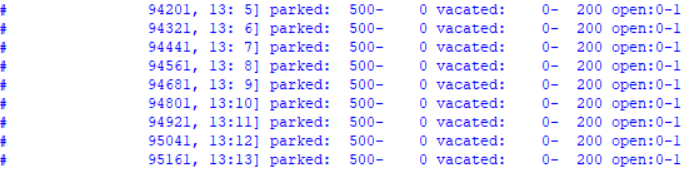
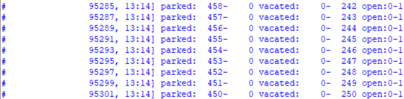
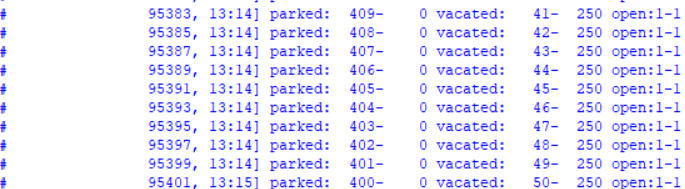
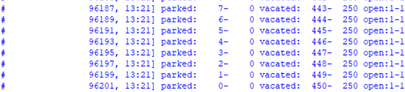
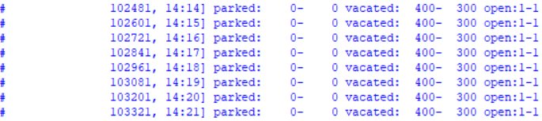
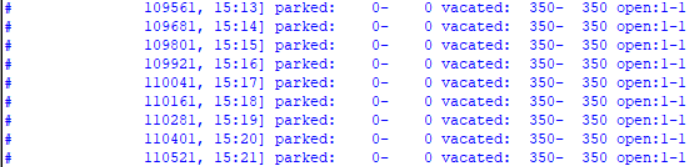
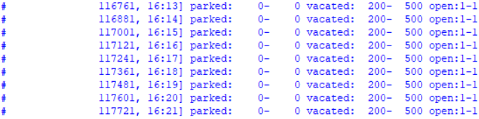
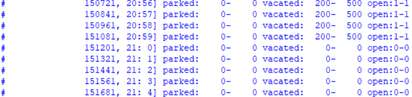

# گزارش

به بیت ورودی clk برای متوجه شدن گذر زمان و بیت reset برای ایجاد مقدار دهی های اولیه نیاز داریم. مقدار ظرفیت برای کارکنان و دیگران به این شکل است:

$`8<=h<13:500-200,\;\;13<=h<14:450-250,\;\;14<=h<15:400-300`$
$`15<=h<16:350-350,\;\;16<=h<21:200-500,\;\;21<=h,h<8:0-0`$

فرض شده که از 9 شب تا 8 صبح ظرفیت پارکینگ صفر است و ورود ممنوع است. اگر ظرفیت بسته باشد و سیگنال بگوید ماشینی وارد می‌شود که مجاز نیست، در شمارنده نمی‌شماریم و فرض می‌کنیم اجازه ی ورود را نداده ایم اما اگر در زمان کاهش ظرفیت ماشینی در پارکینگ باشد که اجازه ندارد، آنرا کم نمی‌کنیم و در شمار نگه می‌داریم.

ابتدا طول هر کلاک را 10 میکرو ثانیه درنظر گرفته بودیم تا واقع گرایانه باشد اما برای تست کردن مدار در مدل‌سیم طول هر کلاک را یک ثانیه قرار دادیم تا قابل آزمایش باشد.

# تست

1. ابتدا زمان را به اندازه‌ی کافی جلو می‌بریم تا ساعت ورود بشود.
2. برای آزمایش محدودیت درحالت عادی 600 واحد زمانی می‌خواهیم که ماشین‌های آزاد وارد شوند (هر کلاک دو واحد زمانی است) که یعنی 300 ماشین آزاد در محدوده زمانی اول قصد دارند وارد پارکینگ شوند که باید 200تایشان اجازه‌ی ورود پیدا کنند.

3. حال 100 ماشین آزاد را خالی می‌کنیم و 500 ماشین دانشگاه را وارد می‌کنیم تا آزمایش کنیم که درصورت کم شدن ظرفیت ماشین‌های دانشگاه و بودن ماشین‌های دانشگاه چه رخ می‌دهد. (در 100 کلاک اول ورود و خروج همزمان قرار می‌دهیم تا آن را هم آزمایش کنیم)

4. الآن 09:13 است پس زمان را 4 ساعت جلو می‌بریم تا تعداد ماشین مجاز دانشگاه 450 بشود. می‌بینید که با اینجا ظرفیت آزاد باید 250 باشد اما 200 جای آزاد گزارش می‌کنیم زیرا 500 جای پارک توسط ماشین‌های دانشگاه پر شده است.

5. حال 50تا از ماشین‌های دانشگاه را یکی یکی خارج می‌کنیم تا تغییرات ظرفیت‌ها را مشاهده کنیم. می‌بینیم که با اینکه ماشین‌های دانشگاه درحال خارج شدن هستند، ظرفیت عمومی افزایش می‌یابد:

6. 50 تا ماشین دانشگاهی دیگر هم خارج می‌کنیم، این بار ظرفیت خالی دانشگاهی افزایش می‌یابد:

7. حال 400 ماشین باقی‌مانده را هم خالی می‌کنیم تا با گذر زمان تغییرات ظرفیت را مشاهده کنیم

8. یک ساعت بعد:

9. یک ساعت بعد:

10. یک ساعت بعد:

11. می‌بینیم که راس ساعت 21:00 ظرفیت پارکینگ بسته می‌شود: 

# سنتز

برای سنتز کردن، طول کلاک را به مقدار قبلی بازمی‌گردانیم. این دو فایل جدید را timer_synt.v و board_synt.v می‌نامیم. فایل‌ها را وارد یک پروژه‌ی کوارتوس می‌کنیم و کامپایل را انجام می‌دهیم که مراحل Analysis & Synthesis، Place & Route، Assemble و Time Analysis را انجام می‌دهد. وارد Time Analysis می‌شویم و Slow 900mV 85C Model/Fmax Summary را نگاه می‌کنیم که Fmax=263.44MHz را گزارش می‌کند. فرض ما این بود که کلاکمان 100000 پالس در ثانیه است که 0.1MHz می‌شود، بنابر این می‌توانیم مدار را به درستی سنتز کنیم و در FPGA اجرا کنیم.

